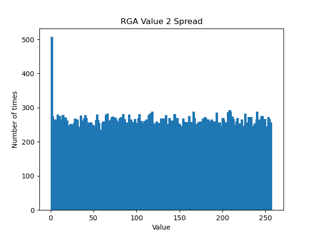

# THE RC4 CIPHER
Stuyvesant Cybersecurity 2022: Final Project

Deven Maheshwari & Jerry Liang

### What is RC4?

The RC4 cipher, short for the Rivest Cipher 4, is a stream cipher first developed by Ron Rivest in 1987 for the RSA Security Company. This cipher was kept a secret until 1994, when the code was leaked. The RC4 cipher is known for its simplicity and speed, and despite numerous vulnerabilities, it is remarkably secure for a cipher of its time.

Today, we will give background on what it is used for, explain how the RC4 cipher works, demonstrate an RC4 encoder/decoder, and showcase one of its vulnerabilities.

---
### Who uses it?

---
### How does it work?

---
### Drawbacks of RC4

The largest vulnerability of RC4 is its random generating algorithm. This is one of the necessary features of the overall cipher since it creates the sequence of bytes that will be XOR'd with the plaintext and ciphertext to produce each other.

The issue here was the uneven distribution of values within this array. In 2001, it was published by Itsik Mantin and Adi Shamir that the first couple values of the RGA array are not as random as was advertised. As seen in the following graph, the value 0 comes up about double as many times as any other value for the second output value of the array. Well, it actually does come up double the amount of times as the other values. Specifically, each bit should have a 1/256 chance of being placed, yet 0 in the second index has a 1/128 probability.

This exploit was used in an attack on WEP (wireless equivalent privacy) wireless networks. Fun fact, it was later replaced by WPA (Wi-Fi protected access).

The fix for this exploit is to disregard the first values of the keystream.

---
### Why does this matter to us?

---
## Links
[Making beautiful markdown](https://ghost.org/changelog/markdown/)
